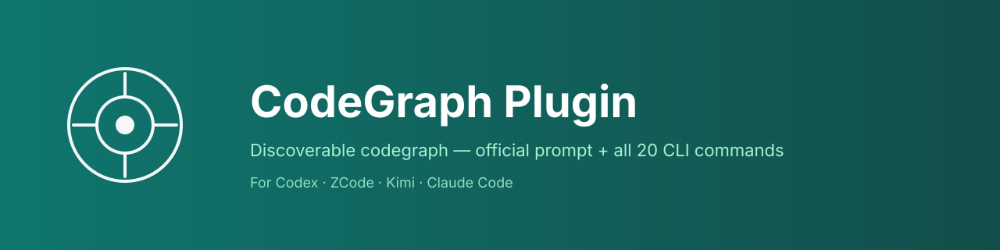

# CodeGraph Plugin

## Plugin marketplaces

This plugin belongs to **Full-stack development**.

| Category | Marketplace | Purpose |
| --- | --- | --- |
| Full-stack development | [Full Stack Plugins](https://github.com/partme-ai/full-stack-plugins) | Architecture and UI design, code understanding, quality checks, code review, workflow governance, and server operations |
| AIGC content creation | [Full AIGC Plugins](https://github.com/partme-ai/full-aigc-plugins) | Image, video, audio, music, 3D, and multimodal content creation |

> Discoverable CodeGraph — official prompt injection + 21 of the 23 CLI commands as slash commands, for Codex / ZCode / Kimi / Claude Code.



## What this plugin does

Three things, and **only** these three:

1. **At session start**, when `<cwd>/.codegraph/` exists, this plugin injects the official CodeGraph prompt block (verbatim from upstream `codegraph/src/installer/instructions-template.ts`) into:
   - The current session, via `SessionStart.additionalContext` JSON output.
   - `<cwd>/.claude/CLAUDE.md` if it exists; else `<cwd>/AGENTS.md`. Uses atomic, marker-fenced section replacement — byte-equal content is a no-op, so this is safe to run alongside `codegraph install`.
2. **Exposes 21 of codegraph's 23 CLI commands** as slash commands in two formats: JSON (`commands/*.json`, declared in `kimi.plugin.json`) and Markdown (`kimi-commands/*.md`), including the four hidden-but-useful maintenance commands (`daemon`, `unlock`, `version`, `telemetry`).
3. **Registers a discovery skill** (`codegraph-helper`) that makes the agent **check whether the repo is indexed and, if not, proactively offer to index it**. The skill activates on code-structure questions *whether or not* `.codegraph/` exists: it checks first, then either answers via CodeGraph or tells the user 「this repo isn't indexed yet — want me to index it?」 and runs `codegraph init` once the user agrees.

## What this plugin does **not** do

- It does **not** modify or replace the `codegraph` CLI. The upstream `colbymchenry/codegraph` (MIT) is the source of truth.
- It does **not** install the `codegraph` CLI. Users run `npm i -g @colbymchenry/codegraph` (or the install script) themselves; the plugin just exposes `/codegraph-install` as a guided wrapper around `codegraph install` for MCP wiring.
- It does **not** run `codegraph init` **without asking**. Indexing writes a `.codegraph/` directory, so the agent must get consent first — but it *does* detect the missing index and prompt for it automatically, because that discovery is the whole point of this plugin. (The SessionStart hook itself stays silent in un-indexed repos, matching the upstream prompt's own "skip CodeGraph entirely" wording.)
- It does **not** hook `PreToolUse`, `PostToolUse`, `UserPromptSubmit`, or `Stop` — only `SessionStart`. This avoids collisions with codeguard-plugin and other plugins that own those events.

## Requirements

- **A working `codegraph` CLI** in `PATH`. Install via:
  ```bash
  curl -fsSL https://raw.githubusercontent.com/colbymchenry/codegraph/main/install.sh | sh
  # or:
  npm i -g @colbymchenry/codegraph
  ```
- **A host agent** (Claude Code, Cursor, Codex CLI, opencode, Hermes Agent, Gemini CLI, Antigravity, or Kiro). For MCP-aware tools the host should already have `codegraph install` run once; otherwise `codegraph_explore` will be missing and the slash commands will fall back to CLI.
- **A `.codegraph/` directory** in the cwd for the SessionStart hook to activate. Without it the plugin is silent.

## Slash commands

21 commands. Format mirrors codegraph's CLI surface. `help` and `ui`/`web` are intentionally not exposed: `help` is covered by the host, and `ui`/`web` opens a browser viewer meant for humans, not agents.

| Command | Equivalent CLI | What it does |
|---|---|---|
| `/codegraph-init` | `codegraph init [path]` | Initialize CodeGraph in the current project |
| `/codegraph-uninit` | `codegraph uninit [path]` | Remove the `.codegraph/` directory (irreversible) |
| `/codegraph-install` | `codegraph install` | One-time wiring of MCP server into host agents |
| `/codegraph-uninstall` | `codegraph uninstall` | Remove MCP wiring from host agents |
| `/codegraph-index` | `codegraph index [path]` | Rebuild the full index from scratch |
| `/codegraph-sync` | `codegraph sync [path]` | Incrementally sync (watcher auto-runs this) |
| `/codegraph-status` | `codegraph status [path]` | Show index status & statistics |
| `/codegraph-query` | `codegraph query <search>` | Search symbols by keyword |
| `/codegraph-explore` | `codegraph explore <query>` | Multi-symbol source + call paths (primary entry) |
| `/codegraph-node` | `codegraph node <name>` | One symbol's source + caller/callee trail, or one file |
| `/codegraph-files` | `codegraph files` | Show indexed project file tree |
| `/codegraph-callers` | `codegraph callers <symbol>` | Find what calls a symbol |
| `/codegraph-callees` | `codegraph callees <symbol>` | Find what a symbol calls |
| `/codegraph-impact` | `codegraph impact <symbol>` | Find what would be affected by changing a symbol |
| `/codegraph-affected` | `codegraph affected [files]` | Find test files affected by changes |
| `/codegraph-daemon` | `codegraph daemon` | Manage background daemons |
| `/codegraph-unlock` | `codegraph unlock [path]` | Remove a stale lock file |
| `/codegraph-version` | `codegraph version` | Print installed version |
| `/codegraph-telemetry` | `codegraph telemetry [status\|on\|off]` | View or change telemetry |
| `/codegraph-upgrade` | `codegraph upgrade [version]` | Upgrade codegraph CLI |

Hidden commands (`prompt-hook`, `serve --mcp`) are **not** exposed by this plugin.

## How the SessionStart hook behaves

```
[SessionStart]
    │
    ▼
Read cwd from JSON payload (fallback: os.getcwd())
    │
    ▼
Check `<cwd>/.codegraph/` exists?
    │
    ├─ NO  → exit 0 silently. (Plugin does nothing; agent continues.)
    │
    └─ YES → resolve target file:
              <cwd>/.claude/CLAUDE.md if exists
              else <cwd>/AGENTS.md
              (NEVER auto-creates <cwd>/.claude/)
                │
                ▼
              Marker-fenced atomic write (byte-equal → no-op)
                │
                ▼
              Emit SessionStart additionalContext JSON
              with the full CodeGraph prompt block
```

The reminder launcher tries `python`, then `python3`, with UTF-8 enabled. If neither interpreter starts, it exits 0. Library-loading and injection errors also fail open; failure to write the instruction file still permits session-context injection. Host-enforced timeouts or process termination remain outside this guarantee.

## Coexistence with `codegraph install`

Codegraph's own `codegraph install` writes the same prompt block to `~/.claude/CLAUDE.md` (or local `./.claude/CLAUDE.md`). The plugin's marker-fenced replacement is **byte-equal idempotent**, so:

- If the user has already run `codegraph install`, the plugin's hook is a no-op on that cluster.
- If the user runs `codegraph install` *after* installing this plugin, `codegraph install`'s own marker-fenced writer (see `codegraph/src/installer/targets/shared.ts:130-194`) is also byte-equal idempotent — no overwrite churn.

The plugin's contribution over `codegraph install` alone:

- **Two audiences covered**: codegraph's installer only writes files (reaches Task-tool subagents via the project instructions file); the plugin also emits `additionalContext` for the main agent at runtime.
- **AGENTS.md fallback**: if a project doesn't use `.claude/CLAUDE.md`, the plugin writes to `AGENTS.md` (the OpenSpec / multi-agent convention).
- **Slash commands**: codegraph install doesn't expose any; this plugin covers 21 of 23 (everything except `help`, `ui`/`web`, and the two hidden `prompt-hook` / `serve --mcp`).

## Maintenance

- **Version bump + manifest sync** is mandatory. Run `node scripts/bump-plugin.mjs codegraph patch|minor|major` after any code change.
- **Sync from upstream**: when codegraph's CHANGELOG mentions `instructions-template.ts`, manually re-sync `scripts/codegraph_lib/prompt.py` and bump patch. See `AGENTS.md`.
- **Plugin-local skills** are tracked in `plugin-local-skills.json`. The `skills.lock.json` is empty by design — no third-party skills are vendored.

## Architecture

See [`docs/codegraph-architecture.md`](docs/codegraph-architecture.md) for the plugin's layered design.

## License

Apache-2.0. See [LICENSE](LICENSE). The official CodeGraph prompt block in `scripts/codegraph_lib/prompt.py` is verbatim from the upstream [colbymchenry/codegraph](https://github.com/colbymchenry/codegraph) project (MIT) — see [NOTICE](NOTICE) for attribution.

## Privacy

See [PRIVACY.md](PRIVACY.md). The plugin is client-side only, makes no network calls, reads no user source code, and writes only to host instruction files using marker-fenced replacement.
