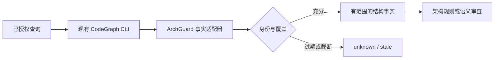

## Context

现有 `scripts/codegraph_lib/{host_targets,instructions_writer,prompt}.py` 负责索引存在检测、指令维护及官方提示词；本插件没有 `.codegraph/`，本轮未创建索引。现有 AGENTS 明确禁止修改上游 CLI、引入阻断 Hook 或自动 install。动机见 [proposal](proposal.md)，行为见 [spec](specs/engineering-fact-provider/spec.md)。

## Goals / Non-Goals

**Goals:** 将已有 CodeGraph 能力纳入工程守卫的事实层，准确披露索引、覆盖和版本；完成 P0 接入发现、P3 语义影响和 P4 基线演进的规划。

**Non-Goals:** 不在本插件实现架构裁判、Rust 内核、第二套数据库或解析器；不修改官方提示词来塞入门禁命令。

## Decisions

1. 共享协议 owner：`codeguard/openspec/changes/add-engineering-guard-core/`，字段说明 `codeguard/docs/engineering-guard/protocol.md`。本插件维护提供者能力清单/调度说明/测试样例，真实 FactEnvelope 转换器在ArchGuard 的事实 adapters 中实现，避免双份逻辑。
2. 先探测实际 CLI 版本及支持命令，不虚构 `codegraph export --json`。仅调用已确认的 status/files/query/符号查询能力；若当前版本没有稳定结构化输出，结果只作发现线索，确定性检查转用语言专用工具。未来上游增强另立上游任务，不纳入本仓偷偷实现。
3. query 绑定实际仓库、源码清单摘要、索引身份与查询预算。区分语法边、解析符号边、启发式边；没有某条边不能在部分覆盖下证明依赖不存在。源码变更或 engine/index 不兼容使受影响事实 stale。
4. 本次只读审查发现 codereview-plugin 索引为旧引擎且有待更新文件；此类状态应成为负向 fixture。图谱路径可用于定位，最终位置与关键关系仍结合当前源码验证。
5. P0 文档和 fixture 不添加新的自动写操作；P3 才提供任务 changedSymbols/consumedApis/affectedTests 的能力映射。affectedTests 只能帮助排序，不允许删减契约指定回归。
6. 框架反射、动态分派、代码生成、宏与跨语言桥接按 provider 能力记录 unknown/partial；人工 ADR 风险不从 AST 自动判定。P4 只对相同事实模型版本进行趋势比较，模型变更先建立可比性。

## Implementation surfaces

| 位置 | 计划修改 | 必保兼容 |
|---|---|---|
| `docs/engineering-guard-plan.md` | 接入、事实限制、授权、升级路径 | 不改变现有命令承诺 |
| `tests/` 新增 provider 契约 fixture | 缺索引、旧版本、截断、位置漂移、动态边 | 测试不自动初始化用户仓库 |
| `commands/`、`kimi-commands/` | 如需新增说明，按现有生成与双格式规则 | 不错误宣称格式对应某宿主 |
| `scripts/codegraph_lib/prompt.py` | 原文 parity 验证 | 不改 CODEGRAPH_INSTRUCTIONS_BLOCK |

实施验证：既有 `python3 -m unittest discover -s tests -t .`、README parity、命令覆盖及真实宿主 SessionStart；共享 adapter fixture 在 codeguard 单独验收。未安装宿主只标 unverified。

## Risks / Trade-offs

- [上游输出漂移] → capability probe + 固定支持矩阵；不解析含糊文本作强制事实。
- [假称完整调用图] → 披露解析模式和预算，负向证明要求完整覆盖。
- [提示词漂移] → 所有治理说明放独立文档，原文块保持字节一致。

## Migration Plan

先发布文档/能力契约，随后协调内核适配；独立运行完全兼容。升级/重建索引仍由既有授权决定。回滚不删除索引，不修改其他插件状态；旧提供者不能满足新必需事实时保持 incomplete。
